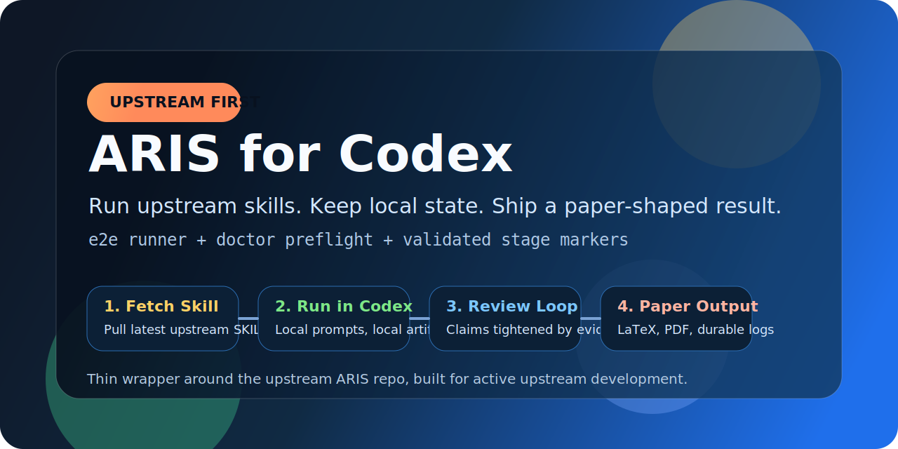
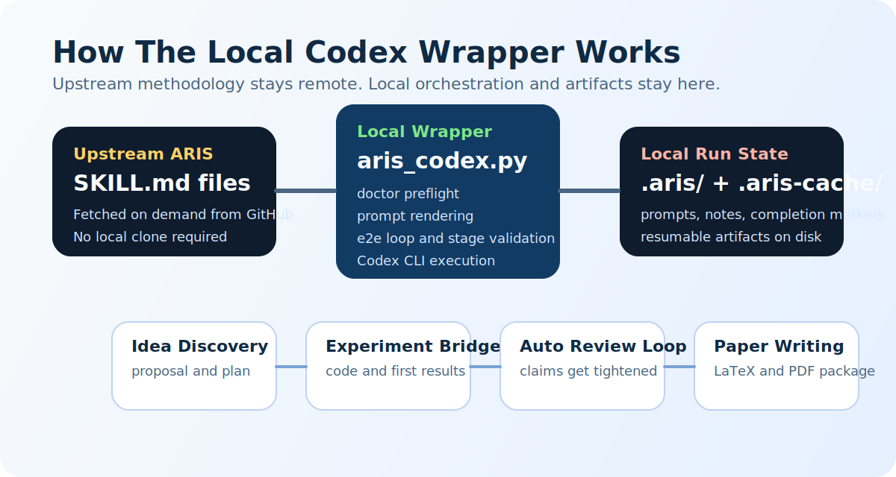

# ARIS Codex Skeleton



Local improvements over upstream ARIS are summarized in [UPSTREAM_IMPROVEMENTS.md](C:\Users\xliup\OneDrive\Documents\codex\researchinsleep\UPSTREAM_IMPROVEMENTS.md).

## Local Improvements Over Upstream

This repo keeps the upstream ARIS skills as the source of truth, but adds a thin local execution layer that makes the workflow more reliable in Codex.

- real one-command `e2e` runner instead of only implicit top-level orchestration
- `doctor` preflight checks for Codex CLI, local project signals, and paper toolchain readiness
- validated stage completion and blocker markers before auto-advance
- cleaner separation between workflow wrapper, run state, and example research project
- local repo skills can extend the end-to-end pipeline without forking upstream ARIS
- explicit end-to-end behavior built on staged, resumable artifacts rather than one monolithic prompt

This workspace is a lightweight Codex-native wrapper around the upstream ARIS repository:

- Upstream repo: [wanshuiyin/Auto-claude-code-research-in-sleep](https://github.com/wanshuiyin/Auto-claude-code-research-in-sleep)
- Goal: use ARIS workflows from Codex without cloning the full upstream repo into this workspace



## What This Skeleton Does

- Fetches selected upstream `SKILL.md` files directly from GitHub at runtime
- Caches them locally under `.aris-cache/`
- Creates persistent local run state under `.aris/runs/<run-id>/`
- Creates persistent project memory under `lessons-learned/`
- Lets local repo skills participate in the same pipeline as upstream stages
- Renders a Codex-friendly stage prompt that inlines the upstream skill text
- Tracks which stage of the ARIS pipeline you are in

## Default Workflow

The default `research-pipeline` is now:

1. `idea-discovery`
2. `experiment-bridge`
3. `auto-review-loop`
4. `paper-writing`
5. `journal-shopping`

That means the end-to-end flow no longer stops at a completed paper. It now continues into venue selection and journal-specific submission preparation.

## What It Does Not Do

- It does not vendor or fork the ARIS skill pack into this repo
- It does not try to preserve Claude-specific slash-command semantics
- It does not depend on Codex custom skills being installed globally

Instead, it treats upstream ARIS skills as the source of truth and wraps them in a local orchestration layer.

## Why This Shape

ARIS is actively changing upstream. If we copied the skills into this workspace, they would drift quickly. This wrapper keeps a very small local surface area and refreshes the authoritative skill content from upstream when needed.

Start with [QUICKSTART.md](C:\Users\xliup\OneDrive\Documents\codex\researchinsleep\QUICKSTART.md) if you want the shortest explanation of how the workflow fits together.
## Quick Start

Run the whole workflow end to end in one command:

```powershell
python .\aris_codex.py e2e research-pipeline --goal "factorized gap in discrete diffusion LMs" --dangerous-bypass
```

Run a quick preflight before starting:

```powershell
python .\aris_codex.py doctor
```

This still uses the staged ARIS artifact model underneath, but the wrapper now drives the stages automatically until the run completes or a stage writes a blocker file.

The default `research-pipeline` now ends with a local `journal-shopping` stage after `paper-writing`, so a completed paper can flow directly into venue selection and three journal-specific submission packages.

If you want the lower-level staged controls, use the commands below.

Create a run:

```powershell
python .\aris_codex.py init research-pipeline --goal "factorized gap in discrete diffusion LMs"
```

See available workflows:

```powershell
python .\aris_codex.py pipelines
python .\aris_codex.py skills
```

Render the current stage prompt for a run:

```powershell
python .\aris_codex.py next <run-id>
```

This writes a prompt file under:

```text
.aris/runs/<run-id>/prompts/
```

Run the current stage through a standalone Codex CLI binary:

```powershell
python .\aris_codex.py run <run-id> --codex-bin "C:\Users\xliup\bin\codex.exe"
```

The wrapper passes `--cd` with this workspace root, `--skip-git-repo-check`, and `--sandbox workspace-write`, so it can run in a plain folder and still create stage artifacts without requiring you to initialize a Git repo first.

If Codex on Windows hits its internal sandbox bug while trying to write files, you can opt into a less restricted workaround:

```powershell
python .\aris_codex.py run <run-id> --dangerous-bypass
```

Use that only when you trust the prompt and workspace, because it tells Codex CLI to bypass its own approvals and sandbox.

Advance to the next stage after a stage is complete:

```powershell
python .\aris_codex.py advance <run-id>
```

Inspect run state:

```powershell
python .\aris_codex.py status <run-id>
```

## Recommended Usage Pattern In Codex

1. Initialize a run with `init`.
2. Use `next` to fetch the current upstream skill and render a local prompt file.
3. Open that prompt file in Codex and execute the stage.
4. When the stage is done, use `advance` to move the run forward.
5. Repeat until the pipeline finishes.

For a one-command version of that same flow, use `e2e`.

For a safer one-command start, run `doctor` first and then `e2e`.

## Notes

- The wrapper keeps upstream skill URLs in `config/upstream_skills.json`.
- Pipelines are defined locally so you can keep your preferred loop shape even if upstream adds more skills.
- The `run` subcommand can target an explicit standalone CLI path, which is recommended on Windows to avoid the packaged app alias under `WindowsApps`.

## Local Skills

This repo can also carry local Codex skills alongside the upstream-wrapper workflow.

- [journal-shopping](C:\Users\xliup\OneDrive\Documents\codex\researchinsleep\skills\journal-shopping\SKILL.md)
  - included in the default end-to-end pipeline after `paper-writing`
  - use after a final paper is complete to shortlist reachable high-prestige journals, study recent venue papers, and prepare three venue-specific submission packages
  - studies 20 recent relevant papers for each final candidate journal
  - adapts the paper to venue-specific writing and presentation style
  - prepares a separate submission package for each of the final three targets

Typical outputs from `journal-shopping`:

- `journal-shopping/longlist.md`
- `journal-shopping/top-3.md`
- `journal-shopping/<journal-slug>/style-notes.md`
- `journal-shopping/<journal-slug>/paper-set.md`
- `submissions/<journal-slug>/`

## Perpetual Lessons Learned

This repo now includes a permanent [lessons-learned](C:\Users\xliup\OneDrive\Documents\codex\researchinsleep\lessons-learned) folder for:

- hardware and software constraints
- troubleshooting and recovery notes
- upstream workflow gaps and local fixes
- general reusable insights

The local runner also appends a usage line to [SESSION_LOG.md](C:\Users\xliup\OneDrive\Documents\codex\researchinsleep\lessons-learned\SESSION_LOG.md) whenever `aris_codex.py` is used, and stage prompts now instruct Codex to record meaningful new lessons before finishing the stage.

## Scratch ADRD Scaffold

This workspace now also contains a minimal from-scratch ADRD research scaffold under `adrd/`.

It is intentionally small and synthetic:

- It does not claim to be a production discrete diffusion LM implementation.
- It gives `experiment-bridge` a real codebase to operate on.
- It includes the ADRD components from the proposal: dependency estimator, router, decoding modes, and budget controller.

Run the synthetic experiment harness:

```powershell
python -m adrd.experiment --strategy adrd
python -m adrd.experiment --strategy factorized
python -m adrd.experiment --preset review_suite
```

Run the tests:

```powershell
python -m unittest discover -s .\tests -p "test_*.py"
```

See [ITERATION_REPORT.md](C:\Users\xliup\OneDrive\Documents\codex\researchinsleep\ITERATION_REPORT.md) for the current post-review router redesign results.
