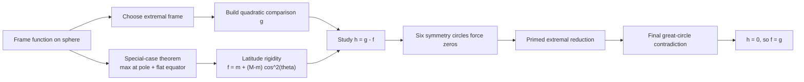
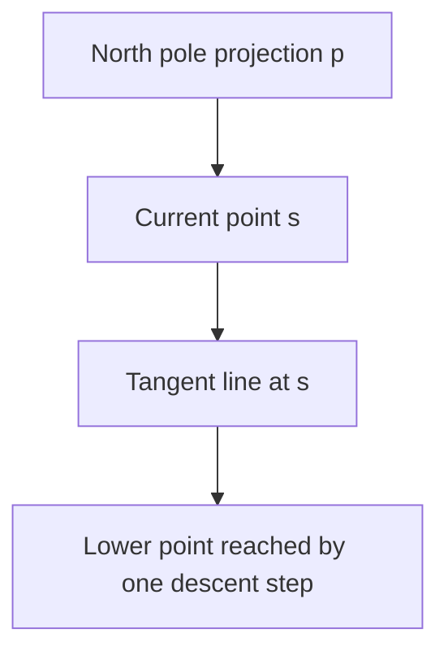
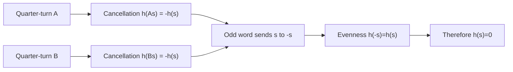
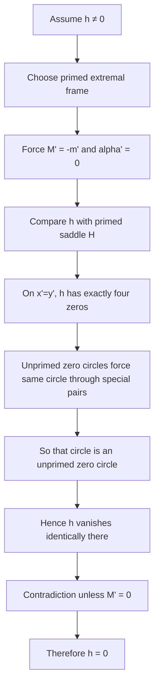

# Toward an Accessible Proof of Gleason's Theorem

## Abstract

Gleason's theorem is one of the foundational rigidity results behind the Born
rule in quantum theory, but many proofs are difficult for non-specialists to
read. This note gives a polished expository reconstruction of the
Cooke--Keane--Moran elementary proof in dimension `3`, with two goals:

1. remove as much advanced physics language as possible,
2. make the geometry and proof structure visible to a mathematically mature
   beginner.

The result is not claimed as a new proof. It is a best-current expository
reconstruction of a published elementary proof, supported by a technical
appendix stack in this project.

## Scope And Status

This note is meant to be read as an expository front end, not as the sole
document of record for every technical detail.

What it does:

1. explains the theorem in sphere language,
2. presents the architecture of the Cooke--Keane--Moran proof,
3. points to the technical notes that now reconstruct most of the proof.

What it does not claim:

1. that we have discovered a new proof,
2. that every supporting lemma is rederived inside this one document,
3. that the full theorem has become genuinely high-school easy.

For the current proof-confidence view, read:

- [CURRENT_PROOF_STATUS.md](C:\Users\xliup\OneDrive\Documents\codex\researchinsleep\examples\gleason-theorem-accessible\CURRENT_PROOF_STATUS.md)
- [PROOF_AUDIT.md](C:\Users\xliup\OneDrive\Documents\codex\researchinsleep\examples\gleason-theorem-accessible\PROOF_AUDIT.md)

## 1. Introduction

Gleason's theorem says, roughly, that if you assign numbers to directions in a
Hilbert space in a way that behaves consistently on every orthonormal basis,
then your assignment must come from a quadratic form. In dimension `3`, this
can be phrased entirely in terms of the unit sphere in ordinary Euclidean
space.

That reformulation already helps. We do not need to begin with density
operators, spectral measures, or advanced quantum formalism. We can start with
something far more geometric:

- a bounded function on the sphere,
- one simple additivity rule on every orthonormal triple,
- and the question of how rigid such a function really is.

The paper by Cooke, Keane, and Moran is still the best published starting point
we have found for this geometric viewpoint. But even that proof is compressed
in places, especially in the middle reduction to latitude and in the final
rigidity argument. This note explains the full strategy in a cleaner narrative
form and points to the detailed technical notes that support each step.

### Notation

Throughout:

- `S` is the unit sphere in `R^3`
- `(p,q,r)` is an unprimed orthonormal frame
- `(x,y,z)` are coordinates in that frame
- `(p',q',r')` is a primed orthonormal frame
- `(x',y',z')` are coordinates in that frame
- `w(f)` denotes the common frame-sum weight of a frame function `f`
- `h = g - f` denotes the difference between a frame function and its quadratic
  comparison function

## 2. The sphere version of the theorem

Let `S` be the unit sphere in `R^3`. A bounded function `f : S -> R` is called
a frame function if there is a constant `w(f)` such that for every orthonormal
triple `(p,q,r)` on the sphere,

`f(p) + f(q) + f(r) = w(f)`.

Gleason's theorem in this setting says that every bounded frame function is the
restriction to the sphere of a quadratic form. Concretely, there exists an
orthonormal coordinate system and real numbers `M, alpha, m` such that

`f(x,y,z) = M x^2 + alpha y^2 + m z^2`

for every point `(x,y,z)` on the sphere.

This is an unexpectedly strong conclusion. The hypothesis merely says that the
sum of the values on any orthonormal frame is constant. The conclusion says the
entire function is forced into a rigid algebraic shape.

## 3. The proof strategy in one picture

The proof has two major halves.

1. First, study a special case where the function is maximal at one pole and
   constant on the equator. In that setting the function must depend only on
   latitude, and in fact must be quadratic in the height coordinate.
2. Then compare a general frame function to the quadratic function built from
   its extremal values. Their difference is forced to vanish.

Here is the high-level flow:

If you only want the conceptual takeaway, this is it:

- the middle of the proof reduces a function on the sphere to a function of one
  variable, namely latitude,
- the end of the proof compares a general frame function with the quadratic
  function suggested by its extremal values and shows the difference must
  vanish.

## 4. The special-case theorem

Fix a north pole `p`. Suppose:

1. `f(p)` is the maximum value of `f`,
2. `f` is constant on the equator orthogonal to `p`.

Then the theorem says:

`f(s) = m + (M-m) cos^2(angle(p,s))`.

So in this special case the function is forced to depend only on latitude, and
the dependence is exactly quadratic.

Why this is plausible:

- points can be moved downward from higher latitude to lower latitude along
  special great circles,
- the frame rule forces the function to decrease along those descent moves,
- once the function only depends on latitude, it satisfies a one-variable
  functional equation,
- boundedness plus that equation force linearity in the latitude parameter.

That is the real heart of the middle proof.

### 4.1 Descent geometry

The special great circle through a point `s` is the one on which `s` is the
northernmost point. Along that circle, moving away from `s` means moving
downward.

In the tangent-plane picture, a descent move becomes a move along a tangent line
to a circle centered at the north pole:

The geometric lemma says that any lower-latitude point can be reached from a
higher-latitude point by finitely many such descent steps.

### 4.2 Why this becomes one-variable

Once descent steps are known to lower the function, the value of `f` is trapped
between upper and lower envelope functions of latitude. The exceptional
latitudes where these envelopes differ form a countable set. A one-variable
warmup theorem then forces linearity off that set, and density kills the
exceptional set entirely.

This is the cleanest part of the proof once reconstructed carefully.

For the technical details, see:

- [WARMUP_THEOREMS_RECONSTRUCTION.md](C:\Users\xliup\OneDrive\Documents\codex\researchinsleep\examples\gleason-theorem-accessible\WARMUP_THEOREMS_RECONSTRUCTION.md)
- [BASIC_LEMMA_RECONSTRUCTION.md](C:\Users\xliup\OneDrive\Documents\codex\researchinsleep\examples\gleason-theorem-accessible\BASIC_LEMMA_RECONSTRUCTION.md)
- [GEOMETRIC_LEMMA_RECONSTRUCTION.md](C:\Users\xliup\OneDrive\Documents\codex\researchinsleep\examples\gleason-theorem-accessible\GEOMETRIC_LEMMA_RECONSTRUCTION.md)
- [SECTION5_RECONSTRUCTION.md](C:\Users\xliup\OneDrive\Documents\codex\researchinsleep\examples\gleason-theorem-accessible\SECTION5_RECONSTRUCTION.md)

## 5. From a general frame function to a quadratic candidate

Now return to a general bounded frame function `f`.

Choose an orthonormal frame in which `f` takes extremal values

- `M`,
- `alpha`,
- `m`.

Using those three numbers, define the quadratic comparison function

`g(x,y,z) = M x^2 + alpha y^2 + m z^2`.

This `g` is itself a frame function with the same values as `f` on the chosen
coordinate axes. So the right object to study is the difference

`h = g - f`.

Then:

- `h` is a bounded frame function,
- `h` has weight `0`,
- `h` vanishes at the three coordinate axes.

From here the task is purely rigidity:

Can a nonzero bounded weight-zero frame function vanish in that much symmetric
geometry?

That question is the real pivot of the proof. The early part says
"quadratic behavior is forced in one very special situation." The late part
says "once you subtract the right quadratic candidate in the general case,
the leftover function has too much symmetry to survive."

## 6. The six-circle mechanism

The answer begins with one of the cleverest ideas in the proof: quarter-turn
rotations.

There are two `90` degree rotations that generate the necessary orbit
identities. By symmetrizing the frame function around these rotations, one
obtains cancellation rules for `h`. Those rules imply that on each of six
symmetry great circles, repeated quarter-turns send a point to its antipode
after an odd number of sign flips. Evenness then forces the value to be zero.

So `h` vanishes on:

- `x=y`
- `x=z`
- `y=z`
- `x=-y`
- `x=-z`
- `y=-z`

This is the geometric skeleton of the late proof.

Technical support:

- [SECTION7_CLAIM_RECONSTRUCTION.md](C:\Users\xliup\OneDrive\Documents\codex\researchinsleep\examples\gleason-theorem-accessible\SECTION7_CLAIM_RECONSTRUCTION.md)

## 7. The final rigidity argument

Assume, for contradiction, that `h` is not identically zero.

Choose a new orthonormal frame adapted to the extrema of `h`. In that primed
frame, `h` has maximum `M'`, minimum `m'`, and middle value `alpha'`.

The proof then forces:

- `M' = -m'`
- `alpha' = 0`

So in the primed frame the natural comparison object is the saddle

`H(x',y',z') = M'(x'^2 - z'^2)`.

By the same six-circle comparison mechanism, now reused in the primed frame,
`h` agrees with `H` on the six primed symmetry circles. In particular, on the
primed circle `x'=y'`, the function `h` must look like the restriction of a
nonzero saddle, and therefore has exactly four zeros there.

But the old unprimed six-circle zeros force that same primed circle through two
special antipodal pairs. That determines the circle uniquely as one of the
unprimed zero circles, so `h` must vanish identically there.

That is impossible unless the saddle coefficient is zero. Hence `M'=0`, and
therefore all extremal values of `h` are zero. So `h=0`, and therefore `f=g`.

This is the endgame:

Technical support:

- [STEP_I_EXTREMAL_REDUCTION.md](C:\Users\xliup\OneDrive\Documents\codex\researchinsleep\examples\gleason-theorem-accessible\STEP_I_EXTREMAL_REDUCTION.md)
- [FINAL_ENDGAME_RECONSTRUCTION.md](C:\Users\xliup\OneDrive\Documents\codex\researchinsleep\examples\gleason-theorem-accessible\FINAL_ENDGAME_RECONSTRUCTION.md)
- [LATE_PROOF_DEPENDENCY_CHAIN.md](C:\Users\xliup\OneDrive\Documents\codex\researchinsleep\examples\gleason-theorem-accessible\LATE_PROOF_DEPENDENCY_CHAIN.md)

## 8. What is genuinely accessible here

This project started with the hope of finding a proof explainable to a strong
high-school student. The honest answer is mixed.

What has become accessible:

- the theorem can be stated without advanced physics,
- the special-case theorem can be explained geometrically,
- the overall proof architecture is now visible,
- the late proof can be followed as a chain of symmetry arguments.

What is still hard:

- the theorem is genuinely rigid and nontrivial,
- the late proof still needs careful great-circle bookkeeping,
- "elementary" in the literature does not mean "easy."

So the right pedagogical claim is not that we have produced a fully high-school
proof of the theorem. The stronger honest claim is:

we now have a much more readable, geometry-first route through an elementary
published proof.

## 9. How To Read The Technical Appendix

If you want to go deeper without getting lost in note sprawl, this order works
best:

1. [BEST_CURRENT_FULL_PROOF.md](C:\Users\xliup\OneDrive\Documents\codex\researchinsleep\examples\gleason-theorem-accessible\BEST_CURRENT_FULL_PROOF.md)
2. [SECTION5_RECONSTRUCTION.md](C:\Users\xliup\OneDrive\Documents\codex\researchinsleep\examples\gleason-theorem-accessible\SECTION5_RECONSTRUCTION.md)
3. [SECTION6_RECONSTRUCTION.md](C:\Users\xliup\OneDrive\Documents\codex\researchinsleep\examples\gleason-theorem-accessible\SECTION6_RECONSTRUCTION.md)
4. [SECTION7_CLAIM_RECONSTRUCTION.md](C:\Users\xliup\OneDrive\Documents\codex\researchinsleep\examples\gleason-theorem-accessible\SECTION7_CLAIM_RECONSTRUCTION.md)
5. [LATE_PROOF_DEPENDENCY_CHAIN.md](C:\Users\xliup\OneDrive\Documents\codex\researchinsleep\examples\gleason-theorem-accessible\LATE_PROOF_DEPENDENCY_CHAIN.md)

## 10. What this project now contains

This expository note is the readable front end. The technical appendix lives in
the surrounding notes:

- [BEST_CURRENT_FULL_PROOF.md](C:\Users\xliup\OneDrive\Documents\codex\researchinsleep\examples\gleason-theorem-accessible\BEST_CURRENT_FULL_PROOF.md)
- [CURRENT_PROOF_STATUS.md](C:\Users\xliup\OneDrive\Documents\codex\researchinsleep\examples\gleason-theorem-accessible\CURRENT_PROOF_STATUS.md)
- [PROOF_AUDIT.md](C:\Users\xliup\OneDrive\Documents\codex\researchinsleep\examples\gleason-theorem-accessible\PROOF_AUDIT.md)

The best way to read the project now is:

1. this expository paper,
2. the proof audit,
3. the best-current full proof,
4. then the individual reconstruction notes only as needed.

## 11. Conclusion

Gleason's theorem remains a deep rigidity result. But the Cooke--Keane--Moran
proof shows that much of its force can be understood through ordinary sphere
geometry, one-variable functional equations, and a carefully managed symmetry
argument.

This project does not claim to have replaced that proof with a brand-new one.
What it does claim is narrower and, I think, useful:

- it reconstructs the proof in a cleaner layered way,
- it makes the middle and late proof mechanisms much easier to see,
- and it provides a practical bridge from "elementary but hard to read" to
  "serious and teachable."

## References

1. A. M. Gleason, *Measures on the Closed Subspaces of a Hilbert Space*, 1957.
   Background source on the original theorem:
   [Celebratio entry](https://celebratio.org/Gleason_AM/article/312/)
2. Roger Cooke, Michael Keane, William Moran, *An elementary proof of
   Gleason's theorem*, 1985.
   [Cambridge page](https://www.cambridge.org/core/journals/mathematical-proceedings-of-the-cambridge-philosophical-society/article/an-elementary-proof-of-gleasons-theorem/89A7AB2F467BD015B2115B637867FB32)
3. Fred Richman and Douglas Bridges, *A Constructive Proof of Gleason's
   Theorem*, 1999.
   [ScienceDirect abstract](https://www.sciencedirect.com/science/article/pii/S0022123698933729)
4. Ehud Hrushovski and Itamar Pitowsky, *Generalizations of Kochen and
   Specker's theorem and the effectiveness of Gleason's theorem*, 2004.
   [PhilSci-Archive](https://philsci-archive.pitt.edu/1263/)
5. Paul Busch, *Quantum states and generalized observables: a simple proof of
   Gleason's theorem*, 2003.
   [PubMed metadata](https://pubmed.ncbi.nlm.nih.gov/14525351/)
6. Victoria Wright and Stefan Weigert, *Gleason-Type Theorems from Cauchy's
   Functional Equation*, 2019.
   [Springer page](https://link.springer.com/article/10.1007/s10701-019-00275-x)
